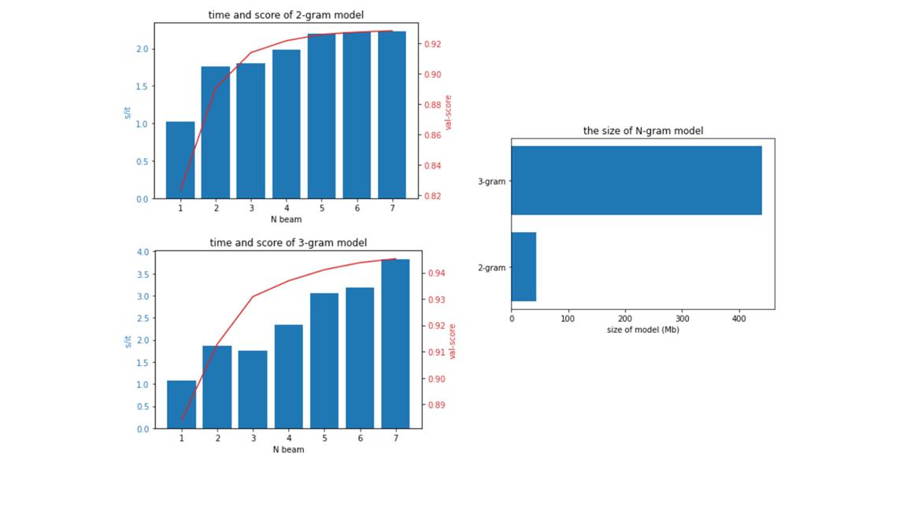

# Giới thiệu
Mã nguồn này được phát triển dựa trên bài viết tại [đây](https://viblo.asia/p/language-modeling-mo-hinh-ngon-ngu-va-bai-toan-them-dau-cau-trong-tieng-viet-1VgZveV2KAw?fbclid=IwAR27jOzmETv8zUj-idE5uMh7BGuKQqvOMtnTRpAdqVhhVwDHXbuTfYy59J0). 
**So với bài viết trên, tác giả đã thay đổi:**
- [x] Sử dụng dữ liệu từ wiki + báo cáo y tế.
- [x] Thêm metric + code test.
- [x] Thêm code tiền/hậu xử lý cho chuỗi đầu vào.
- [x] Khảo sất độ chính xác model và tốc độ với các tham số khác nhau.
## Tiền xử lý
Ở đây chúng ta không dùng tokenizer tạo từ các tập data trên mà dùng word list từ [vietnamese-wordlist](https://github.com/duyetdev/vietnamese-wordlist) để tạo bộ tokenizer bằng cách split các từ trong word list và chọn lại các từ đơn.
Các từ không nằm trong word list sẽ được gán thành 'unknown'. Điều này làm giảm đi rất nhiều kích thước model và làm tăng độ chính xác.
## Model
Triển khai model 2grams và 3grams. 
## Train model
```sh
python train.py train.tone 2gram_model.pkl --ngram 2
```
```sh
python train.py train.tone 3gram_model.pkl --ngram 3
```
## Test model
```sh
python test_2gram.py val.notone val.tone 2gram_model.pkl
```
```sh
python test_3gram.py val.notone val.tone 3gram_model.pkl
```
## Kết quả

| ngram | nbeam | val_score | runtime(500 sen) | test_score | model_size |
| -- | -- | -- | -- | --| -- |
| 2gram | 1 | 0.8231 | 8.5 |  | 41Mb |
||2|0.8905|14.65|||
||3|0.9138|15|||
||4|0.9216|16.5|||
||5|0.9258|18.3|0.9221||
||6|0.9273|18.5|||
||7|0.9282|18.9|||
|3gram|1|0.8840|9||441Mb|
||2|0.9128|15.5|||
||3|0.9309|14.35|||
||4|0.9369|19.5|||
||5|0.9411|25.5|0.9401||
||6|0.9438|26.5|||
||7|0.9453|31.9|||


